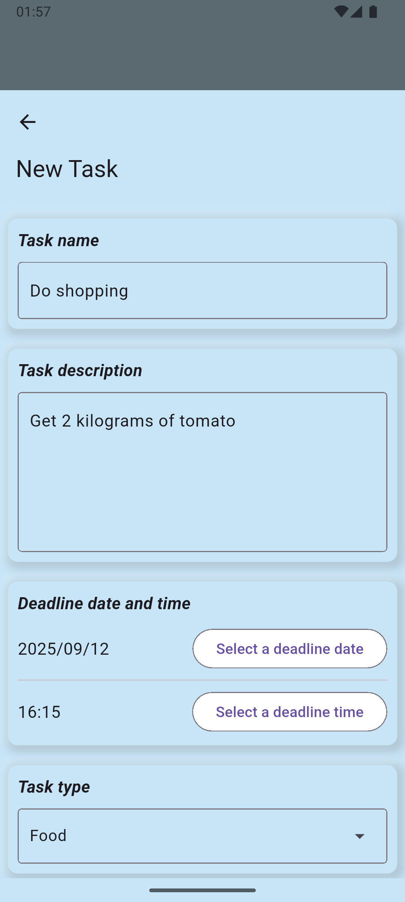
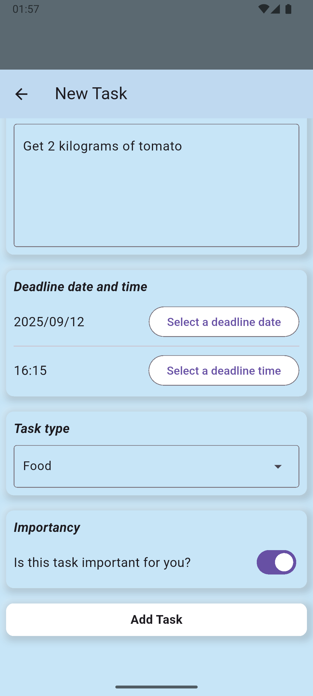
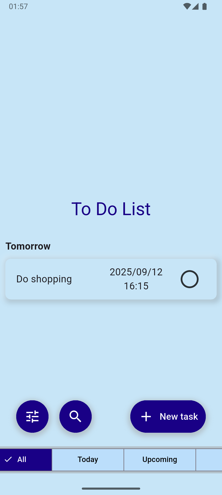
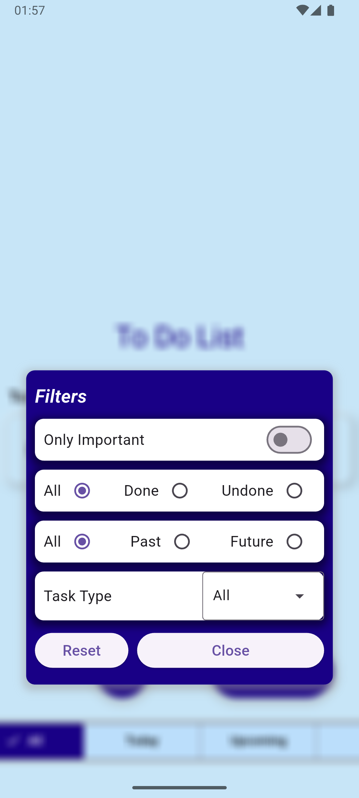
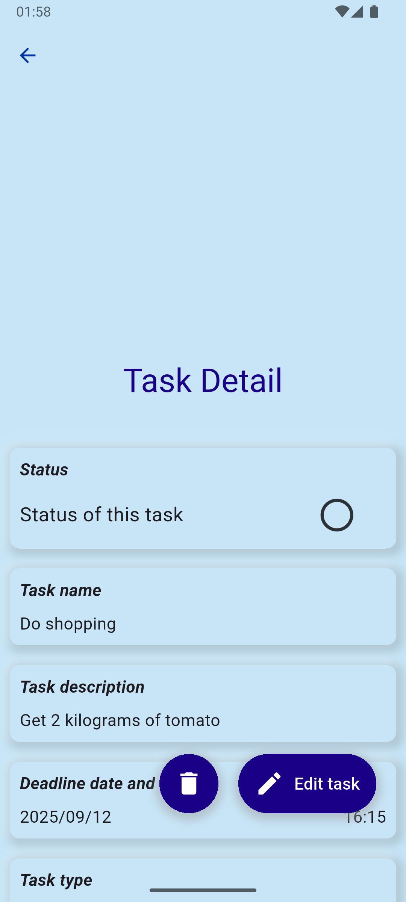
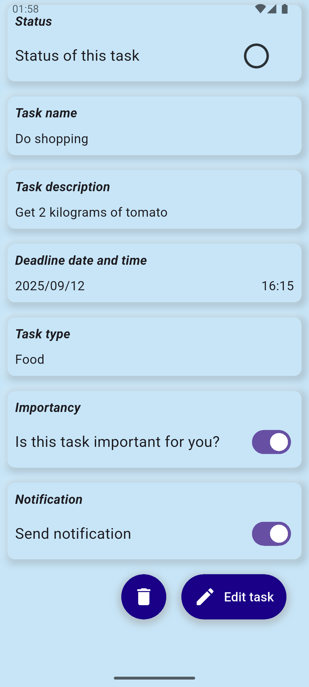

# flutter-todolist
A simple task management application made with Flutter, designed for one-handed use and featuring mostly neumorphism design style.

## Screenshots
                  

## Features
  * CRUD Operations - Create, read, update and delete tasks
  * Task Tabs - All, Today, Upcoming...
  * Push Notifications - Get notifications on deadline of tasks
  * Smooth UX - Ergonomic and clean design with mostly neumorphism style

## Built With
  * Framework: [Flutter][flutter-url]
  * Language: [Dart][dart-url]
  * Packages:
    * State Management: [provider][provider-url]
    * Notifications: [awesome_notifications][awesome-notifications-url]
    * Local Database:
      * [drift][drift-url]
      * [drift_sqflite][drift-sqflite-url]

## Installation
1. Clone the repo
```sh
git clone https://github.com/aliosmansahin/flutter-todolist.git
```
2. Get necessary packages
```sh
flutter pub get
```
3. Run the app
```sh
flutter run
```

<!-- LINKS -->
[flutter-url]: https://flutter.dev/
[dart-url]: https://dart.dev/
[provider-url]: https://pub.dev/packages/provider
[awesome-notifications-url]: https://pub.dev/packages/awesome_notifications
[drift-url]: https://pub.dev/packages/drift
[drift-sqflite-url]: https://pub.dev/packages/drift_sqflite
